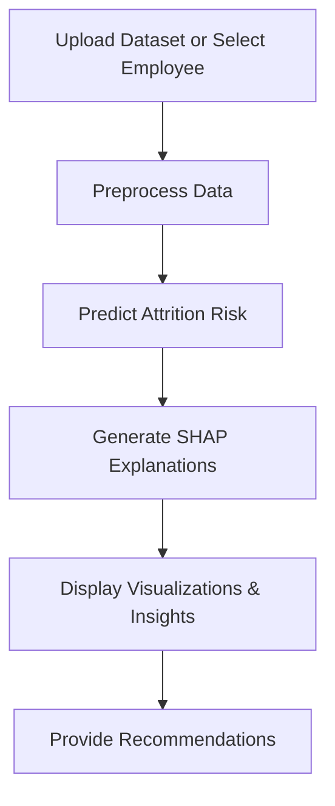

# 👩‍💼 Employee Attrition Predictor

An intelligent Employee Attrition Prediction Dashboard that helps HR teams identify employees who are at risk of leaving the company. Built using **Streamlit**, **Machine Learning**, and **SHAP Explainability**, the platform provides predictions, visual insights, and interactive simulations to support better decision-making.

---

## 🚀 Key Features

* **Employee Search & Analysis**: Search employees from historical records, filter by department or role, and explore detailed employee profiles.
* **Attrition Risk Prediction**: Predict the probability of employee attrition and classify employees into different risk levels.
* **Explainable AI (SHAP)**:

  * Understand why an employee is predicted to leave.
  * View the top factors influencing the prediction.
  * Interactive SHAP visualizations for transparent AI.
* **Interactive Employee Simulator**: Modify employee attributes and instantly see how the attrition risk changes.
* **Dataset Upload & Batch Prediction**: Upload employee datasets in CSV format and analyze attrition trends across the organization.
* **Dark & Light Mode**: Modern, responsive dashboard with theme switching and interactive visualizations.

---

## 🛠️ Tech Stack

* **Language**: Python
* **Framework**: Streamlit
* **Libraries**: Pandas, NumPy, Scikit-learn, SHAP, Joblib, Matplotlib
* **Machine Learning Model**: Random Forest Classifier

---

## 📂 Project Structure

```text
Employee-Attrition-Predictor/
├── app.py                     # Main Streamlit dashboard UI
├── attrition_model.pkl        # Trained Random Forest model
├── model_features.pkl         # Feature list used by the model
├── requirements.txt          # Required dependencies
├── sample_data/              # Example employee datasets
├── assets/                   # Images and visualizations
└── README.md                 # Project documentation
```

---

## ⚙️ Installation & Usage

### 1. Clone the repository

```bash
git clone https://github.com/hasinirishi/Employee-Attrition-Predictor.git

cd Employee-Attrition-Predictor
```

### 2. Install dependencies

```bash
pip install -r requirements.txt
```

### 3. Run the Dashboard

```bash
streamlit run app.py
```

---

## 📊 How the System Works



---

## 🎯 Main Functionalities

| Feature                   | Description                                     |
| :------------------------ | :---------------------------------------------- |
| **Employee Search**       | Search and analyze historical employee records  |
| **Risk Prediction**       | Predict the likelihood of employee attrition    |
| **SHAP Explainability**   | Explain why the model made a prediction         |
| **Interactive Simulator** | Test different employee scenarios               |
| **Dataset Upload**        | Perform batch predictions on uploaded CSV files |
| **Dark/Light Mode**       | User-friendly and modern interface              |

---

## 🔮 Future Improvements

* Support for multiple employee dataset formats
* Automatic column mapping and feature extraction
* Universal preprocessing pipeline
* Cloud deployment
* Enhanced explainability dashboards

---

## 👩‍💻 Author

**Hasini Rishi**

Computer Science Engineering Student | Machine Learning Enthusiast

GitHub: https://github.com/hasinirishi

---

⭐ If you found this project interesting, consider giving it a star!
